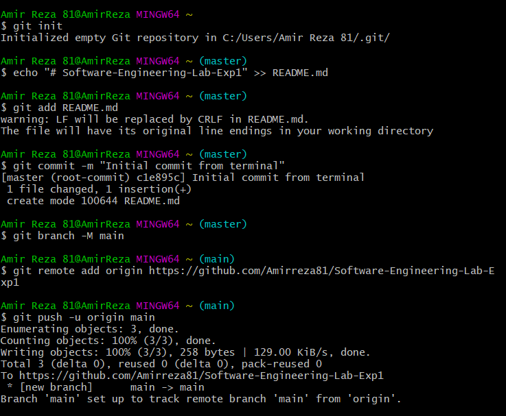
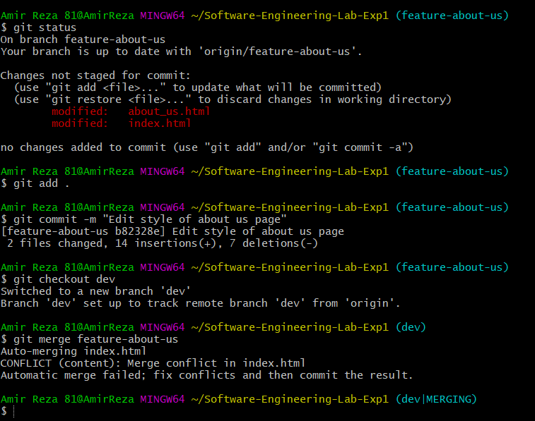
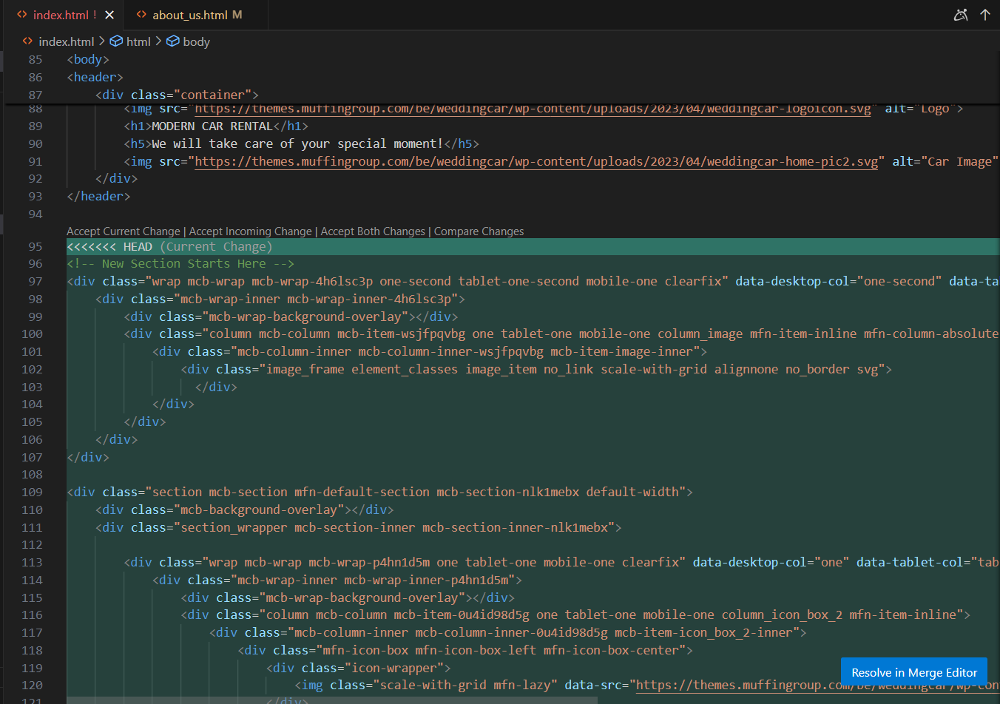
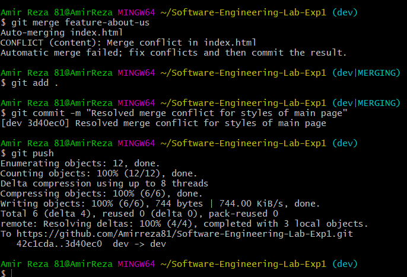
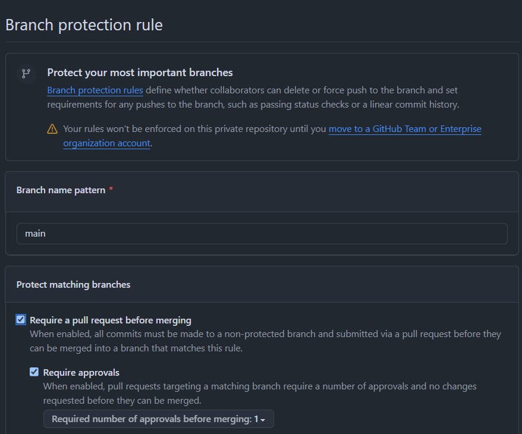
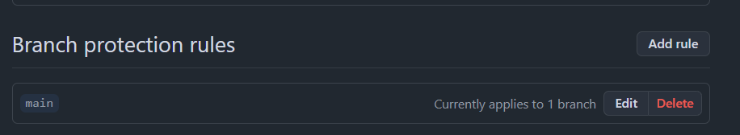
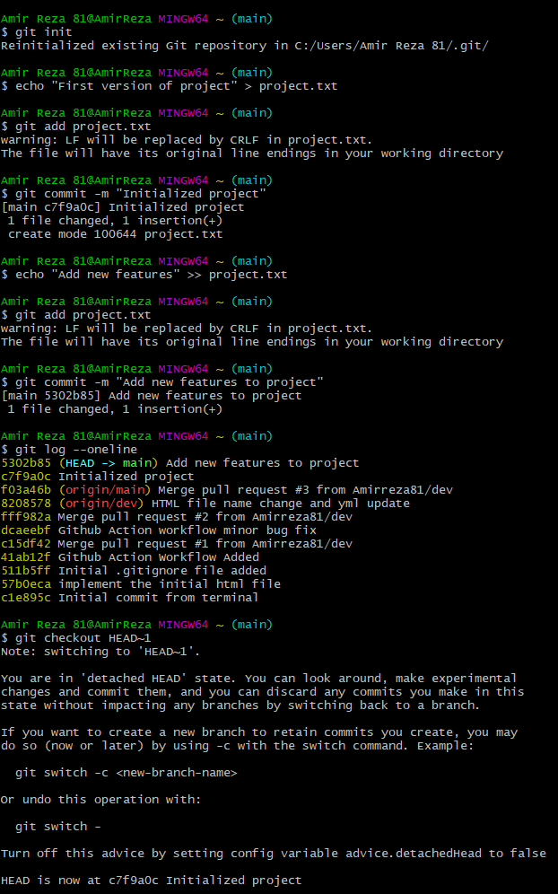

# **آزمایش اول - مدیریت نسخ پروژه و یک‌پارچه‌سازی و استقرار مستمر**


### گزارش آزمایش اول: فرانت‌اند ایستا با قابلیت استقرار خودکار

**ابزارهای مورد استفاده:**
- Git
- GitHub, GitHub Actions
- Html, CSS

---

#### مراحل انجام آزمایش

**ایجاد مخزن و راه‌اندازی Git**

در ابتدا وارد حساب گیت‌هاب شده و یک مخزن جدید با نام
`Software-Engineering-Lab-Exp1` ایجاد نمودیم. سپس مطابق با تصویر زیر دستورات را وارد نموده و و اولین کامیت را همراه با فایل `README.md` ارسال نمودیم.



**ایجاد فایل .gitignore**

<!-- Reza -->

**استقرار خودکار با GitHub Actions**

<!-- Reza -->

**کامیت‌ها**

طبق خواسته صورت آزمایش، بیشتر از 20 کامیت در این پروژه وجود دارد که هر کدام معنادار می‌باشند و همان‌طور که از متن آن‌ها مشخص است، اتفاق مشخصی در فرآیند پیاده‌سازی رخ داده است.

**مدیریت و تعداد شاخه‌ها**

<!-- Omid -->


**رفع Conflict**
##### کانفلیکت اول:

<!-- Reza -->

##### کانفلیکت دوم:
کانفلیکت زمانی رخ داد که یکی از اعضا تغییراتی در فایل 
`index.html` به وجود آورد تا ترتیب قرارگیری دکمه‌های این صفحه مرتب بشود. سپس بعد از تلاش برای مرج کردن شاخه 
`feature-about-us` با شاخه `dev`،
به دلیل اینکه تغییرات در یک فایل مشابه بود، گیت قادر به تصمیم‌گیری خودکار نبود که کدام تغییر را بپذیرد. به همین دلیل یک `merge conflict` به وجود آمد.
برای حل آن نیز مطابق تصاویر زیر، به طور دستی تعارض را بر طرف کرده و کامیت را ارسال نمودیم.





**محافظت کردن از شاخه main**

مطابق با تصاویر زیر، اعمال محدودیت در مخزن خود در Github، شاخه‌ی main پروژه را محافظت کردیم به صورتی که تنها از طریق pull request امکان ادغام شاخه‌ای دیگر با شاخه‌ی main را داشته باشیم.




**ایجاد pull request**

<!-- Omid -->

**استفاده از دستورات متنوع برای پیش‌برد فعالیت‌ها**

در این آزمایش تلاش شد تا با استفاده از دستورات مختلف و به کمک ترمینال یادگیری خود را افزایش دهیم.
بخشی از استفاده از ترمینال را در تصاویر موجود در گزارش مشاهده می‌نمایید. به طور خلاصه از دستورات زیر در طول آزمایش بیشتر استفاده نمودیم:
```bash
git init
git pull
git push
git status
git log
git commit
git add
git rebase
git merge
git checkout
git branch
git stash
```

---

### **سوالات**

- سوال اول:

<!-- Omid -->


---

- سوال دوم:

<!-- Omid -->

---

- سوال سوم:

<!-- Omid -->

---

- سوال چهارم:

<!-- Omid -->

---

- **سوال پنجم: منظور از stage یا همان index چیست؟ دستور stash چه کاری را انجام می‌دهد؟**

**پاسخ:**
در Git، مرحله‌ی stage یا index به بخشی از مخزن گفته می‌شود که در آن تغییرات فایل‌ها قبل از ثبت نهایی (commit) نگهداری می‌شوند. زمانی که تغییری در فایل‌ها ایجاد می‌شود، این تغییرات ابتدا در working directory قرار دارند. با اجرای دستور git add، تغییرات به stage اضافه می‌شوند و آماده‌ی کامیت شدن خواهند بود. در نهایت، با اجرای git commit این تغییرات به تاریخچه‌ی مخزن اضافه می‌شوند.

دستور git stash برای ذخیره‌ی موقتی تغییرات در مخزن استفاده می‌شود. این دستور زمانی مفید است که بخواهید بدون از دست دادن تغییرات فعلی، روی شاخه‌ی دیگری کار کنید یا مخزن را به وضعیت قبلی بازگردانید. تغییرات ذخیره‌شده را می‌توان در آینده با استفاده از git stash apply یا git stash pop دوباره اعمال کرد.

مثال:
```bash
# افزودن تغییرات به stage (index)
git add file.txt
# ثبت تغییرات در مخزن (commit)
git commit -m "Add changes"
# ذخیره‌ی موقتی تغییرات بدون کامیت کردن
git stash
# بازیابی تغییرات ذخیره‌شده
git stash pop

```

---

- **سوال ششم: مفهوم snapshot به چه معناست؟ ارتباط آن با commit چیست؟**

**پاسخ:** 
در Git، **snapshot** به معنای تصویری از وضعیت کل پروژه در یک لحظه‌ی مشخص است. هر زمان که یک **commit** انجام می‌شود، Git یک snapshot از تمام فایل‌های نسخه‌بندی‌شده را ذخیره می‌کند. این snapshot شامل تمامی تغییرات جدید نسبت به commit قبلی است.

برخلاف سیستم‌های قدیمی کنترل نسخه که فقط تغییرات خطی را ذخیره می‌کردند، Git هر commit را به عنوان یک snapshot کامل در نظر می‌گیرد. البته برای بهینه‌سازی فضا، فایل‌های بدون تغییر فقط به نسخه‌ی قبلی لینک می‌شوند. هر commit شامل بخش‌های زیر است:
- **Tree:** اطلاعات مربوط به فایل‌ها و دایرکتوری‌های پروژه را نگه می‌دارد.
- **Parent commit:** ارتباط بین snapshots را حفظ می‌کند.
- **Metadata:** شامل اطلاعاتی مثل نویسنده، تاریخ و پیام commit است.

این ویژگی باعث می‌شود که بتوان به‌راحتی بین snapshots جابه‌جا شد، تغییرات را مقایسه کرد و در صورت نیاز پروژه را به وضعیت قبلی بازگرداند.

مثال:
```sh
# ایجاد یک مخزن جدید
git init
# ایجاد یک فایل و افزودن متن اولیه
echo "First version of project" > project.txt
# افزودن فایل به stage و ایجاد snapshot اولیه
git add project.txt  
git commit -m "Initialize project"  
# ایجاد تغییرات در فایل
echo "Add new feature" >> project.txt
# ثبت snapshot جدید
git add project.txt  
git commit -m "Add new feature"
# مشاهده لیست snapshots
git log --oneline  
# بازگشت به snapshot قبلی
git checkout HEAD~1  
```
این ساختار این امکان را می‌دهد پروژه را به نسخه‌های مختلف در طول زمان برگرداند، تغییرات را بهتر مدیریت کرد و از شاخه‌بندی (branching) و ادغام (merging) برای کار تیمی مؤثرتر استفاده کرد.

در ترمینال:


---

- **سوال هفتم: تفاوت‌های local repository و remote repository چیست؟**

**پاسخ:** تفاوت‌های بین Local Repository و Remote Repository در Git:

1. مکان ذخیره‌سازی:
   - Local Repository: مخزن محلی است که روی کامپیوتر شما ذخیره می‌شود. تمام تاریخچه و تغییرات پروژه در این مخزن نگهداری می‌شود و شما بدون نیاز به اتصال اینترنتی می‌توانید به آن دسترسی داشته باشید.
   - Remote Repository: مخزن از راه دور است که معمولاً بر روی یک سرور یا سرویس آنلاین (مثل GitHub، GitLab یا Bitbucket) قرار دارد. این مخزن برای به اشتراک‌گذاری کد با دیگران و همکاری تیمی استفاده می‌شود.

2. دسترسی و هماهنگی:
   - Local Repository: تنها شما (یا کسانی که به سیستم شما دسترسی دارند) می‌توانند به این مخزن دسترسی داشته باشند.
   - Remote Repository: این مخزن به‌صورت عمومی یا خصوصی به اشتراک گذاشته می‌شود و معمولاً توسط چندین نفر قابل دسترسی است. همه اعضای تیم می‌توانند تغییرات را ارسال (push) یا دریافت (pull) کنند.

3. سینک کردن تغییرات:
   - Local Repository: تغییرات در این مخزن تنها روی سیستم شما ثبت می‌شود و هیچ تأثیری بر روی سایر اعضای تیم ندارد مگر اینکه تغییرات را به مخزن از راه دور ارسال کنید.
   - Remote Repository: تغییرات این مخزن برای همگان قابل مشاهده است و اعضای تیم می‌توانند تغییرات یکدیگر را از اینجا دریافت کنند.

4. عملیات‌ها:
   - Local Repository: تمام دستورات Git مانند `git commit`, `git add`, `git log`, و غیره در مخزن محلی انجام می‌شود.
   - Remote Repository: عملیات‌هایی مانند `git push`, `git pull`, و `git fetch` به مخزن از راه دور مربوط می‌شوند.

5. مخزن‌های متصل:
   - Local Repository: مخزن محلی معمولاً یک یا چند remote (مانند `origin`) برای هماهنگی با مخزن‌های از راه دور دارد.
   - Remote Repository: مخزن از راه دور یک نسخه متمرکز از پروژه است که معمولاً در سرور قرار دارد و در آنجا به‌صورت مشترک توسط تیم توسعه مدیریت می‌شود.

مثال:
- برای ارسال تغییرات از Local Repository به Remote Repository:  
  ```git push origin main```

- برای دریافت آخرین تغییرات از Remote Repository به Local Repository:  
  ```git pull origin main```

- برای مشاهده remote‌های متصل به مخزن محلی:  
  ```git remote -v```

در نهایت: مخزن محلی برای کارهای فردی و تغییرات آزمایشی استفاده می‌شود، در حالی که مخزن از راه دور برای همکاری تیمی و اشتراک‌گذاری کد با دیگران کاربرد دارد.


--- 

### **تقسیم وظایف**
در این آزمایش تلاش شد تا تمامی افراد سهم تقریبا یکسانی در پیاده‌سازی آزمایش داشته باشند. همان‌طور که در کانبان‌برد مشاهده می‌شود، در تمامی بخش‌ها افراد سهم مشابهی داشتند. چه در پیاده‌سازی انواع صفحات و چه در نوشتن گزارش و آماده سازی پاسخ سوالات داده شده، تمامی تلاش خود را نمودیم تا فعالیت‌ها به طور مساوی تقسیم بشوند.

[**لینک کانبان‌برد**](https://github.com/users/Amirreza81/projects/1)

### **اعضای تیم**

- امیررضا آذری - 99101087
- <!-- Reza -->
- <!-- Omid -->
